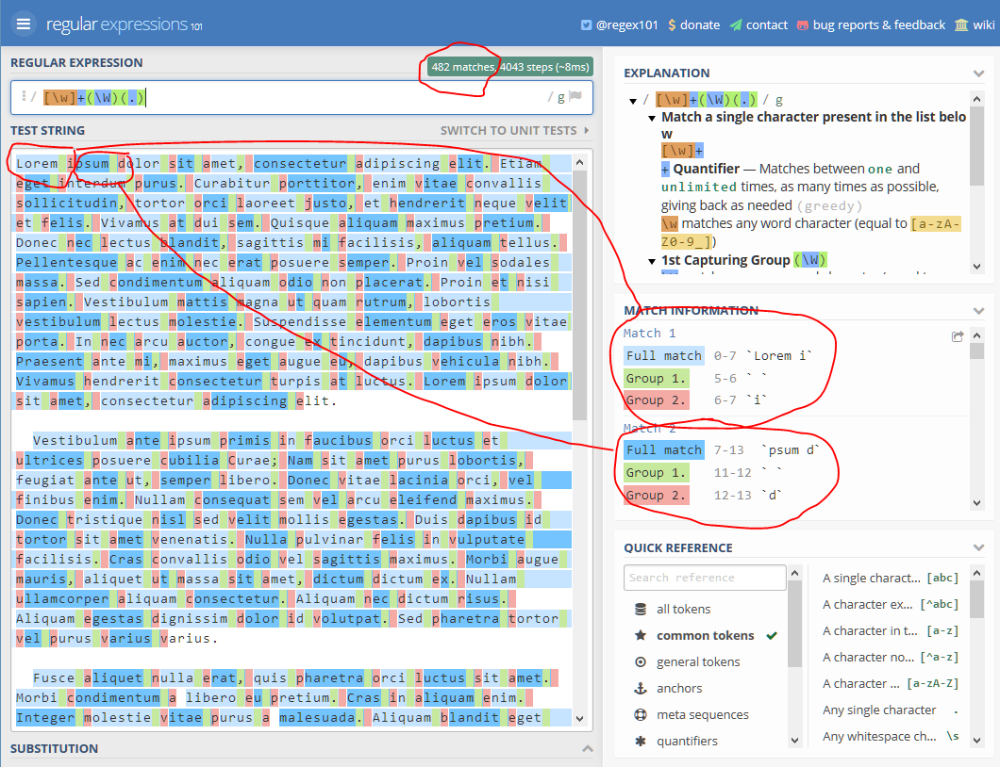
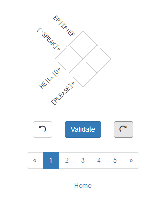

# Regex opgaver

De første opgaver med Regex laver vi ikke i R, men vha. et smart værktøj til at teste og afprøve regexes i, som hedder ["Regex101.com"](http://regex101.com). Fordelen er at den giver hints om, hvordan dit mønster skal forståes, den highlighter matches og grupper og mange andre smarte ting, der gør det nemmere for dig at forstå hvad dit regex gør og hvorfor.

* I explanation kan du vha. farvekoder se hvilken del af dit mønster der gør hvad.
* I test string, kan du se alle matches highlighted i skiftevis blå og mørkeblå.
    * Hver gruppe i dit match har også sin egen farve!
* Du kan nemt se hvor mange matches der er
* Du kan nemt inspicere hvertenkelt match

Der er også en god *quick reference*, som du kan gå på opdagelse i, og finde og lære om smarte ting du kan gøre med dine regex'es

Hvis du gerne vil teste dit mønster af på forskellig tekst, har vi lavet en side på regex101 med forskellig tekst, der kan være godt at teste op imod: [Test din regex her](https://regex101.com/r/fgNCYj/2)

## 1 Basic
Sektion 1, antager at du kun kender til "literal searches", og formålet med disse er at gøre dig bekendt med regex101, og få en fornemmelse af hvilke begrænsninger en bogstavelig søgning har, ifht. egentlige mønstrer i regexes.

Forestil dig at du har modtaget et datasæt over patienter, hvor en af kolonnerne hedder "symptomer". Hver linje repræsenterer en patient.

* **1.1** Kan du finde antallet af patienter med feber? 
* **1.2** Hvad med alle, der har smerte? 
* **1.3** Hvilket problem er der med at finde antallet af patienter med smerte? 
* **1.4** Hvilke problemer vil du have hvis du skal finde alle med rygsmerter (I modsætning til alle med rygproblemer?)

[Patient symptomer](https://regex101.com/r/9g6SoR/2)

**OBS** I Regex101, får du kun at vide hvor mange matches der er på et given mønster. Når du begynder at bruge regex i R, vil du nemt kunne spørge hvor mange linier/datapunkter et mønster matcher på, frem for kun hvor mange matches der er. Det er vigtigt at holde sig for øje at disse 2 ting ikke er det samme! 

## 2 Klammer

**Opgave 2.1**
Vi fortsætter med at kigge på patienterne fra sektion 1. Du er interesseret i at finde alle patienter med smerter i ryggen. Desværre er symptomerne noget en læge er tastet ind i fri-tekst. Kan du ved hjælp af klammer finde alle 62 patienter med rygsmerter? [Patient symptomer](https://regex101.com/r/9g6SoR/2)

**Serier**
Serier kan bruges til at inkludere flere tegn i en klamme, end man lige selv gider at skrive. Fx, matcher `[0-9]` alle numre og [a-z] alle små bogstaver i alfabetet imellem a og z. Bindestregen virker her lidt ligesom kolon gør i R. I R expanderer `1:5` til `[1, 2, 3, 4, 5]` og i regex expanderer `[1-5]` til `[12345]`

* **2.2** Hvordan vil du lave en klamme der dækker over store bogstaver, a-z?
* **2.3** Hvad med store OG små bogstaver?
* **2.4** Hvad dækker `[a-å]` over? Hvordan vil du lave en klamme der dækker over hele det danske alfabet? [Test din regex her](https://regex101.com/r/fgNCYj/2)

**Opgave 2.5**
En mere typisk opgave vil være at finde løbe-numrer; fx nummerplader. Forestil dig at du har modtaget et datasæt med 500 nummerplader, både danske og tyske.
Kan du lave et regex mønster, der kan finde de 248 danske nummerplader? Kan du finde de tyske? https://regex101.com/r/4Sxzad/1

* En dansk nummerplade består af 2 bogstaver og 5 tal. I dette tilfælde er der en seperator imellem det sidste bogstav og det første tal
* En tysk nummerplade består af 4 bogstaver og 2 tal. Der er en seperator imellem hver blok af 2 tegn.
* For nemhedsskyld antager vi at der altid bliver brugt een seperator, og at de eneste seperator tegn der bliver brugt er " " (`mellemrum`) "-" (`bindestreg`) og ":" (`kolon`)

## 3 Character Classes

**Opgave 3.1**
Kan du løse opgave 2.5 uden brug af klammer, men kun med brug af character classes? Du kan antage at seperatoren kan være et hvilketsomhelst tegn, undtagen bogstaver eller tal (alle ikke-alfa-numeriske tegn). Kig under *meta sequences* i kassen *Quick References* på regex101.com for at få inspiration til character classes du kan bruge i dit mønster.

## 4 Repititions, +,*,?

* **4.1** Kan du forkorte længden af dit mønster fra opgave 3.1 vha. repititions? 
* **4.2** Kan du lave en udgave som også vil kunne godtage nummerplader *uden* et seperator tegn?
* **4.3** opgave 4.2 kan løses ved brug af 2 forskellige repitition tegn. Kan du finde en metode mere?

## 5 Special Characters

### 5.2 `^ $`, start/slutning af en streng

Hvor mange gange optræder ordet "the" i starten af en film-titel ifht. indeni en film-titel? Hvordan vil du checke om der findes filmtitler hvor "the" er det *sidste* ord? Antag at disse [100 tilfældige film titler](https://regex101.com/r/tFtEDu/1) er et repræsentativt korpus.

### 5.3 `.`, wildcard / vilkårligt tegn

* **5.3.1** Kan du finde alt hvad der står i parantes i film-titlerne? Kan du finde alle punktummer?

* **5.3.2** Hvad er forskellen på `.*` og `.*?` ? Kig på [listen over filnavne](https://regex101.com/r/blti61/2) og test forskellen på `.*?\.`, `.*\.`

### 5.4 `|`, eller

* **5.4.1** Kan du finde alle `Rmd` og `txt` filer i [listen over filnavne](https://regex101.com/r/blti61/2) ?

## 6 Groups
* **6.1** Lav en capture gruppe, der fanger alle filnavne, *uden* deres extension. [listen over filnavne](https://regex101.com/r/blti61/2)
* **6.2** En del af filnavne har 2 extensions. Lav et mønster med 2 capture groups, til at fange hhv. første og anden extension.

*hint* Filnavnet ligger i starten af en linje!

## Regex Crosswords
Hvis du bliver hurtigt færdig med en opgave, kan du hjælpe din kollega, eller prøve kræfter med regex krydsord.

* https://regexcrossword.com/